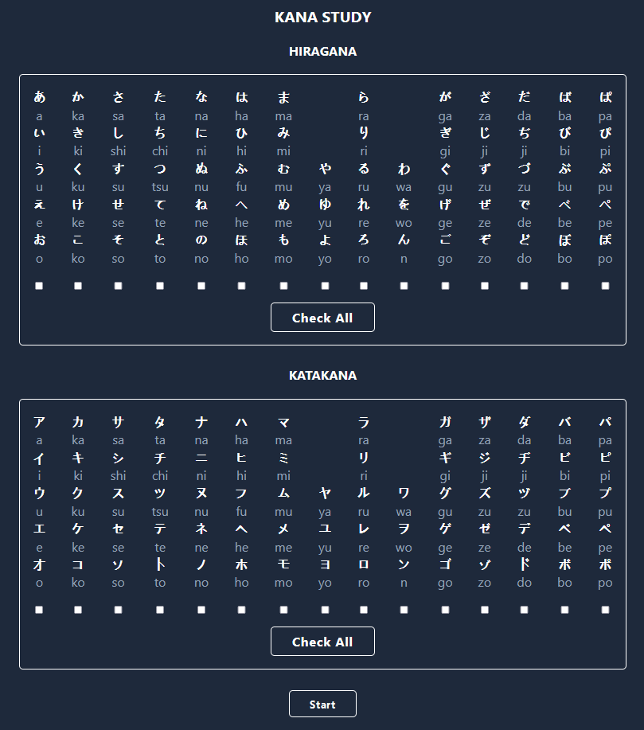
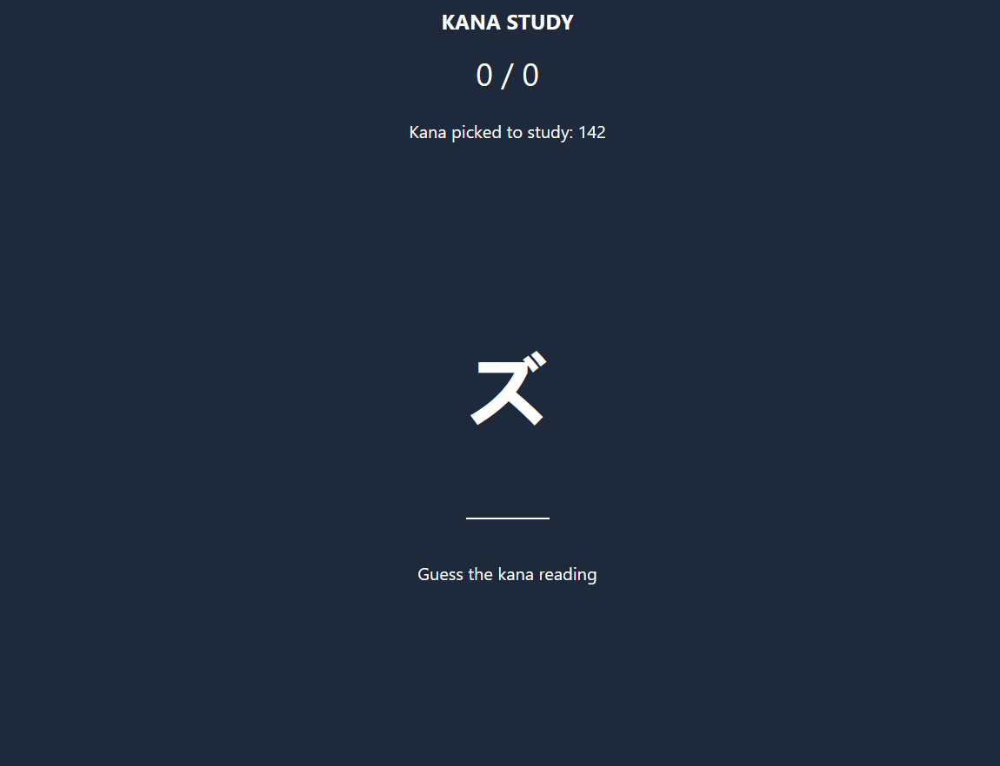

# Kana Study

### Japanese Hiragana and Katakan study app

[LIVE DEMO](https://kanastudy.netlify.app/)

### This app is an expanded and modified version of TylerPottsDev's [React Hiragana Quiz](https://github.com/TylerPottsDev/yt-react-hirigana-quiz)

## Features

- Hiragana
- Katakana
- High score tracking with Local storage
- Can choose specific groups of kana to study

## Stack

- ReactJS
- Vite
- Tailwindcss

Deployed on Netlify
